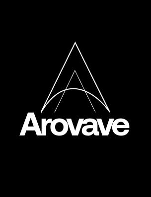

<p align="center">
  
</p>

<h1 align="center">Arovave Marketing Calculator</h1>

<p align="center">
  <strong>A powerful, real-time pricing engine with an Excel-like formula builder — built for marketing teams and sales operations.</strong>
</p>

<p align="center">
  <a href="https://arovave-marketing-calculator.vercel.app">🌐 Live Demo</a> •
  <a href="#-features">✨ Features</a> •
  <a href="#-tech-stack">🛠 Tech Stack</a> •
  <a href="#-getting-started">🚀 Getting Started</a> •
  <a href="#-architecture">🏗 Architecture</a>
</p>

<p align="center">
  
  
  
  
  
  
</p>

---

## 📋 Overview

Arovave Marketing Calculator is a **dynamic pricing engine** that empowers admins to build complex, multi-formula calculators — and lets sales teams use them instantly. Think of it as a **no-code formula builder** where you can create calculators with nested brackets, mixed operators, and chained formulas — all evaluated in real-time using the **shunting-yard algorithm**.

> **No backend required for the calculator** — the entire app runs client-side using Zustand for state management. Data persists in the browser's local storage.

---

## ✨ Features

### 🗂 Hierarchical Category System

- **Unlimited nesting** — create root categories and sub-categories to any depth
- **Drag & drop reordering** with smooth animations
- **Breadcrumb navigation** — always know where you are in the tree
- **One calculator per category** — each leaf category gets its own calculator

### 📊 Excel-Like Calculator Builder

Build calculators using 4 row types — just like designing a spreadsheet:

| Row Type | Description | Example |
|----------|-------------|---------|
| **Input** | User enters a number | Length, Width, Quantity |
| **Dropdown** | User picks from options (each with a rate) | Material Type → Steel ₹50, Wood ₹30 |
| **Fixed** | Admin-set constant value | Tax Rate = 18% |
| **Calculated** | Formula that references other rows | Area = Length × Width |

### 🧮 Advanced Formula Builder with Brackets

The crown jewel — build complex mathematical expressions with:

- **Mixed operators** — `+`, `−`, `×`, `÷` in a single formula
- **Nested brackets** — `( ( A + B ) × C )` with unlimited depth
- **Operator precedence** — multiplication/division before addition/subtraction
- **Real-time bracket counter** — shows unclosed brackets as you build
- **Smart button states** — buttons enable/disable based on formula validity
- **Shunting-yard algorithm** — industry-standard expression evaluation

```
Example: (Width + Length) × Rate + (Tax × 2) = accurate result
```

### 🏷 Grand Total Selector

- Admins can create **multiple formulas** per calculator
- **Select any formula** as the **Grand Total** — highlighted with a golden badge
- Toggle between formulas to change what counts as the final price

### 📥 Import from Excel / Google Sheets

- **Upload `.xlsx`, `.xls`, `.csv`** files directly
- **Paste Google Sheet URL** — auto-fetches and parses (must be publicly shared)
- **Smart type detection** — auto-detects Input, Dropdown, Fixed, and Calculated fields
- **Preview before import** — review and adjust types before applying

### 📦 Cost Blocks (Multi-Stage Pricing)

Build complex pricing pipelines with cost blocks:

- **5 block types**: Area-Based, Fixed Rate, Dropdown Rate, Per Piece, Aggregation
- **Chain formulas** — output of one block feeds into the next
- **Toggle blocks** on/off, reorder, and mark as optional

### 📝 Temp Item Lists

- Admins define **reference item lists** per calculator (e.g., accessories, add-ons)
- Sales reps can **add items** from the reference list or create custom ones
- Items contribute to the **Grand Total** automatically

### 🎨 Premium UI/UX

- **Liquid glass design** — glassmorphism with blur and saturation effects
- **Smooth animations** — fade-in, slide-up, scale-in transitions
- **Responsive layout** — works on desktop and tablet
- **Dark-on-white theme** — high contrast, bold typography (Outfit font)
- **Lucide icons** — consistent, crisp iconography throughout

---

## 🛠 Tech Stack

### Frontend (`packages/web`)

| Technology | Purpose |
|-----------|---------|
| **React 18** | UI framework with hooks |
| **TypeScript 5.5** | Type-safe development |
| **Vite 6** | Lightning-fast dev server & build |
| **Tailwind CSS 3.4** | Utility-first styling |
| **Zustand 5** | Lightweight state management with persistence |
| **React Router 7** | Client-side routing |
| **Decimal.js** | Precise decimal arithmetic (no floating-point errors) |
| **Lucide React** | Beautiful icon library |
| **XLSX** | Excel/CSV file parsing |
| **Zod** | Schema validation |
| **React Hook Form** | Form management |

### Backend (`packages/server`) — Optional

| Technology | Purpose |
|-----------|---------|
| **Fastify** | High-performance HTTP server |
| **Prisma** | Database ORM |
| **PostgreSQL** | Relational database |

### Engine (`packages/engine`)

| Technology | Purpose |
|-----------|---------|
| **TypeScript** | Pure calculation engine |
| **Decimal.js** | Precise math operations |

---

## 🏗 Architecture

```
arovave-marketing-calculator/
├── packages/
│   ├── web/                    # 🌐 React SPA (main app)
│   │   ├── src/
│   │   │   ├── components/
│   │   │   │   ├── Layout.tsx            # App shell with glass header
│   │   │   │   └── admin/
│   │   │   │       ├── CalculatorBuilder.tsx  # Excel-like row builder + FormulaBar
│   │   │   │       ├── CategoryTree.tsx       # Hierarchical category manager
│   │   │   │       ├── CostBlockBuilder.tsx   # Multi-stage pricing blocks
│   │   │   │       ├── DropdownOptionEditor.tsx  # Option manager for dropdown rows
│   │   │   │       └── TempListManager.tsx    # Temporary item list editor
│   │   │   ├── pages/
│   │   │   │   ├── admin/AdminPanel.tsx   # Admin dashboard + Sheet importer
│   │   │   │   └── sales/SalesCalculator.tsx  # Sales-facing calculator UI
│   │   │   ├── stores/
│   │   │   │   └── templateStore.ts      # Zustand store (all business logic)
│   │   │   ├── types/
│   │   │   │   └── calculator.ts         # TypeScript interfaces
│   │   │   ├── App.tsx                   # Router setup
│   │   │   └── main.tsx                  # Entry point
│   │   ├── vercel.json                   # Vercel deployment config
│   │   └── vite.config.ts                # Build configuration
│   │
│   ├── engine/                 # ⚙️ Calculation engine (pure TS)
│   │   └── src/
│   │       ├── calculator.ts             # Main calculation orchestrator
│   │       ├── executor.ts               # Expression executor
│   │       ├── parser.ts                 # Formula parser
│   │       ├── resolver.ts               # Variable resolver
│   │       ├── validator.ts              # Input validation
│   │       ├── conditional.ts            # Conditional logic
│   │       ├── rounding.ts               # Number rounding utilities
│   │       └── types.ts                  # Engine type definitions
│   │
│   └── server/                 # 🖥 Fastify API server (optional)
│       └── src/
│           ├── app.ts                    # Server setup with CORS & routes
│           ├── routes/
│           │   └── quotes.ts             # Immutable quote creation
│           └── lib/
│               └── prisma.ts             # Database client
│
├── docker-compose.yml          # 🐳 Full-stack local development
├── Dockerfile.server           # Server container
├── Dockerfile.web              # Web container
├── tsconfig.base.json          # Shared TypeScript config
└── package.json                # Monorepo workspace config
```

### Data Flow

```
┌─────────────────────────────────────────────────────┐
│                    ADMIN PANEL                       │
│                                                     │
│  Category Tree ──→ Calculator Builder ──→ Formulas  │
│       │                   │                  │      │
│       │            ┌──────┴──────┐     ┌─────┴────┐ │
│       │            │ Row Types:  │     │ Brackets  │ │
│       │            │ • Input     │     │ Operators │ │
│       │            │ • Dropdown  │     │ Shunting  │ │
│       │            │ • Fixed     │     │ Yard Algo │ │
│       │            │ • Calculated│     └─────┬────┘ │
│       │            └──────┬──────┘           │      │
│       │                   │                  │      │
│       ▼                   ▼                  ▼      │
│  ┌─────────────────────────────────────────────┐    │
│  │          Zustand Store (templateStore)       │    │
│  │     State + Business Logic + Persistence     │    │
│  └─────────────────────┬───────────────────────┘    │
└────────────────────────│────────────────────────────┘
                         │
                         ▼
┌─────────────────────────────────────────────────────┐
│                 SALES CALCULATOR                     │
│                                                     │
│  Browse Categories ──→ Fill Inputs ──→ See Results  │
│                                           │         │
│                              ┌────────────┴───────┐ │
│                              │ Real-Time Calc:    │ │
│                              │ • Formula eval     │ │
│                              │ • Decimal.js math  │ │
│                              │ • Grand Total      │ │
│                              │ • Temp items sum   │ │
│                              └────────────────────┘ │
└─────────────────────────────────────────────────────┘
```

---

## 🚀 Getting Started

### Prerequisites

- **Node.js** ≥ 20.0.0
- **npm** ≥ 9.0.0

### Quick Start (Frontend Only)

```bash
# 1. Clone the repository
git clone https://github.com/Atx-3/arovave.in-calculator-real.git
cd arovave.in-calculator-real

# 2. Install dependencies
npm install

# 3. Start the development server
npm run dev:web

# 4. Open in browser
# → http://localhost:5173
```

### Full Stack (with Docker)

```bash
# 1. Clone and configure
git clone https://github.com/Atx-3/arovave.in-calculator-real.git
cd arovave.in-calculator-real
cp .env.example .env

# 2. Start all services
docker-compose up -d

# Services:
# → Frontend:  http://localhost:5173
# → Backend:   http://localhost:3001
# → Database:  postgresql://localhost:54322
```

### Available Scripts

| Command | Description |
|---------|-------------|
| `npm run dev:web` | Start frontend dev server |
| `npm run dev:server` | Start backend API server |
| `npm run dev` | Start both frontend + backend |
| `npm run build` | Build all packages for production |
| `npm run lint` | Run ESLint across all packages |
| `npm run format` | Format code with Prettier |
| `npm run test:engine` | Run calculation engine tests |

---

## 🌐 Deployment

### Vercel (Recommended)

The app is deployed as a **static SPA** on Vercel.

1. Connect your GitHub repository to Vercel
2. Set **Root Directory** to `packages/web`
3. Vercel auto-detects Vite and builds with `vite build`
4. SPA rewrites are configured in `packages/web/vercel.json`

**Live URL**: [arovave-marketing-calculator.vercel.app](https://arovave-marketing-calculator.vercel.app)

### Docker

```bash
# Build and run with Docker Compose
docker-compose up --build -d
```

---

## 🧮 How the Formula Engine Works

The formula builder uses the **shunting-yard algorithm** to correctly evaluate mathematical expressions with:

1. **Tokenization** — User builds formula by clicking field/operator/bracket buttons
2. **Infix to Postfix** — Shunting-yard converts `A + B × C` to `A B C × +`
3. **Evaluation** — Postfix expression is evaluated left-to-right with a value stack
4. **Decimal.js** — All math uses arbitrary-precision decimals (no `0.1 + 0.2 = 0.30000000000000004`)

### Operator Precedence

| Priority | Operators | Description |
|----------|-----------|-------------|
| **High** | `×` `÷` | Multiplication, Division |
| **Low** | `+` `−` | Addition, Subtraction |
| **Override** | `( )` | Brackets override precedence |

### Example

```
Formula: ( Width + Length ) × Rate

Tokens: [ (, Width, +, Length, ), ×, Rate ]
         ↓ Shunting-yard algorithm
Postfix: [ Width, Length, +, Rate, × ]
         ↓ Evaluate with values: Width=5, Length=10, Rate=100
Result:  (5 + 10) × 100 = 1500
```

---

## 🗂 Data Model

```typescript
// Category — supports unlimited nesting
interface Category {
  id: string;
  name: string;
  parentId: string | null;
  order: number;
}

// Calculator — one per category
interface Calculator {
  id: string;
  name: string;
  categoryId: string;
  rows: CalculatorRow[];         // Excel-like rows
  costBlocks: CostBlock[];       // Multi-stage pricing
  tempItems: TempItem[];         // Reference items
}

// Row Types: 'input' | 'dropdown' | 'fixed' | 'calculated'
interface CalculatorRow {
  id: string;
  label: string;
  key: string;
  type: RowType;
  fixedValue?: string;           // For 'fixed' type
  dropdownOptions?: DropdownOption[];  // For 'dropdown' type
  formula?: RowFormula;          // For 'calculated' type
  isTotal?: boolean;             // Grand total flag
}

// Formula with bracket support
interface RowFormula {
  tokens: FormulaToken[];        // Full infix expression
  operands: string[];            // Legacy fallback
  operation: Operation;          // Legacy fallback
}

type FormulaToken = {
  type: 'field' | 'operator' | 'number' | 'bracket';
  value: string;
};
```

---

## 📸 Screenshots

### Sales Calculator — User-Facing
>
> Clean, intuitive interface for sales reps. Browse categories, fill inputs, see real-time pricing.

### Admin Panel — Category Manager
>
> Build hierarchical product categories with drag & drop reordering.

### Admin Panel — Calculator Builder
>
> Excel-like row editor with input, dropdown, fixed, and calculated row types.

### Admin Panel — Formula Builder with Brackets
>
> Advanced formula builder with nested brackets, mixed operators, and real-time validation.

---

## 🔒 Security

- **No sensitive data** transmitted — all calculations run client-side
- **State persistence** via `localStorage` — no external database required for the calculator
- **Server package** (optional) uses Prisma with parameterized queries to prevent SQL injection
- **CORS** configured for development proxy

---

## 📄 License

This project is private and proprietary to **Arovave**.

---

<p align="center">
  Built with ❤️ by the <strong>Arovave</strong> team
</p>
